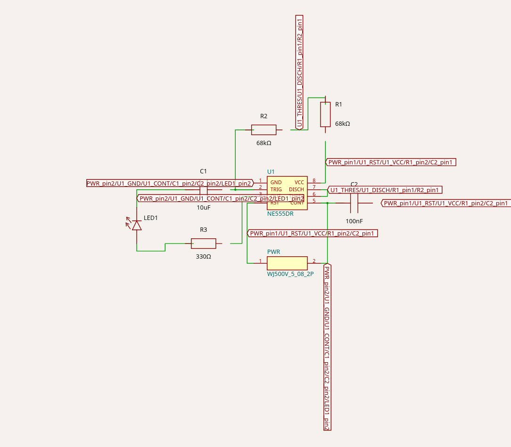
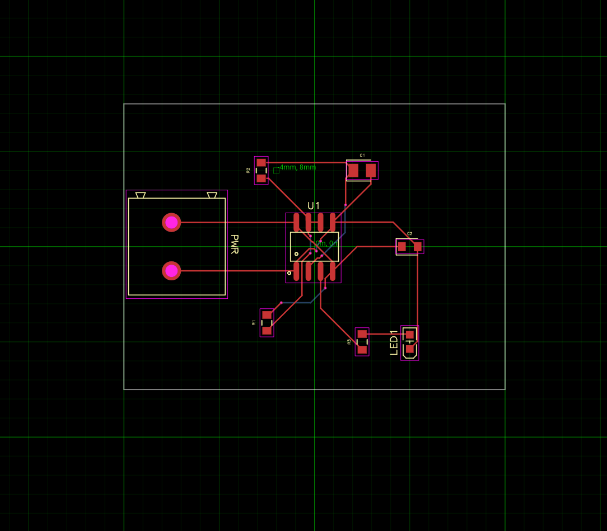
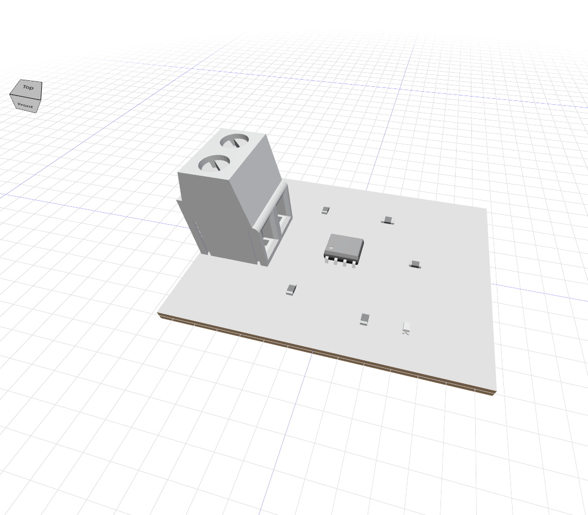
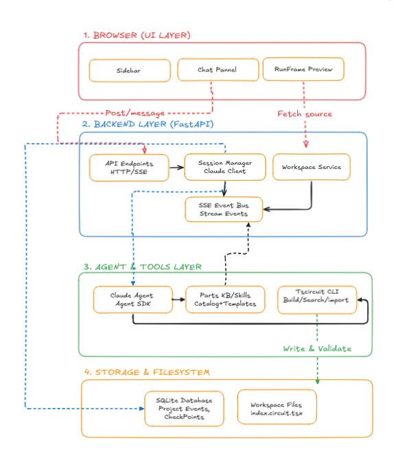
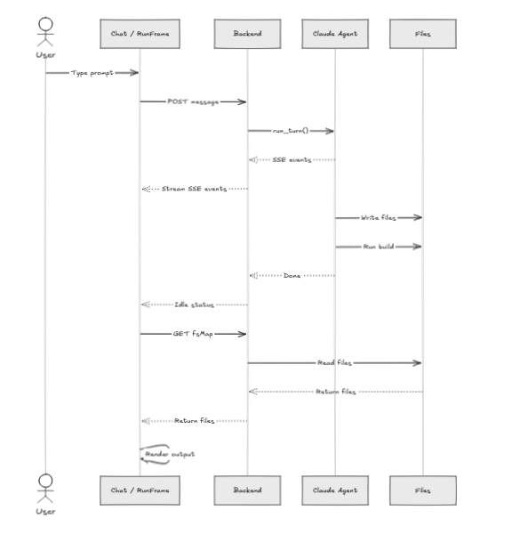
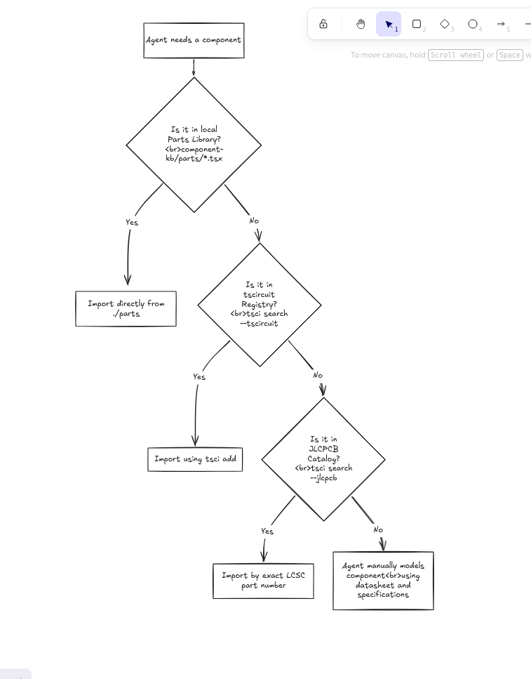

# ⚡ VoltEdge

An agentic circuit-design dashboard: chat with a Claude-powered sidekick that turns
natural-language prompts into real [tscircuit](https://tscircuit.com) PCB designs, rendered
live as Schematic / PCB / 3D, with drag-to-edit + in-browser re-autoroute.

**Docs:** [SPEC](docs/SPEC.md) · [PLAN](docs/PLAN.md) · [TASKS](docs/TASKS.md) ·
[PACKAGES](docs/PACKAGES.md) · [Phase 0 results](docs/PHASE0_RESULTS.md)

## Example: a 555 LED blinker, from one prompt

Everything below was produced by a single chat turn — the agent designed the astable
555 circuit (68 kΩ / 68 kΩ / 10 µF ≈ 1 Hz), sourced parts, placed and routed the
2-layer 40×30 mm board, ran the validation checks, and checkpointed.

<details>
<summary>The prompt</summary>

> Create a simple LED blinker board using a 555 timer.
>
> Requirements:
> * 5V input power through a 2-pin screw terminal
> * One red status LED blinking around 1 Hz
> * Use common, easily sourceable parts
> * Include a current-limiting resistor for the LED
> * Add silkscreen labels for power input, LED, and main components
> * Make the PCB 2-layer
> * Keep the board roughly 40 mm × 30 mm
> * Place the LED near the top edge
> * Put the power terminal on the left edge
> * Generate a clean schematic, PCB layout, and 3D render
> * Run validation checks before showing the checkpoint
> * If any part is unavailable in the tscircuit registry, try JLCPCB exact part sourcing
> * Do not silently change the board size, voltage, or blink-rate target
> * Ask me only if a decision would significantly affect the final board

</details>

**Schematic** — NE555DR astable, R3 330 Ω LED limiter, WJ500V screw terminal:



**PCB layout** — power terminal on the left edge, LED near the top, silkscreen labels:



**3D render:**



## How it works

VoltEdge is three pieces: a **React frontend**, a **FastAPI backend**, and a **Claude
agent** (via the Claude Agent SDK) that drives the `tsci` CLI inside a per-project
workspace. The browser renders with tscircuit **RunFrame**, which evaluates the
workspace source *in the browser* — so the PCB/schematic are interactive (drag, Run,
autoroute), not just static images.



### A turn, step by step



Key points:
- `index.circuit.tsx` is the **one entry** tscircuit builds and the UI renders. The agent
  overwrites it each turn (a plain `circuit.tsx` is *not* an entry and is ignored).
- The rich transcript (thinking + tool calls, shown as accordions) is **persisted** as an
  event stream, so reloading or switching sessions restores it.
- New workspaces scaffold in **~0.5 s** via a shared template with hardlinked
  `node_modules` (a one-time ~30–50 s template build seeds it).

## Where components come from

There is **no MCP server** — the agent sources parts two ways:



1. **Local parts library** (`component-kb/parts/*.tsx`, mounted into each workspace as
   `./parts/`): verified board components — ESP32-C3 SuperMini, GY-521/MPU-6050, STM32
   Blue Pill, Arduino Uno shield — with real dimensions, footprints, and pinouts. The
   `components` skill documents the catalog; the agent imports these directly.
2. **tscircuit registry** via `tsci search` / `tsci import` for anything not in the
   library — this pulls authoritative footprints from the tscircuit registry / **JLCPCB**
   parts catalog.

> A datasheet/parts **MCP** (wrapping SnapEDA/Octopart/DigiKey) is a possible future
> addition, but is **not** currently wired up.

## Prerequisites

| Tool | Version | Notes |
|---|---|---|
| Node.js | ≥ 18 (22.x) | |
| Bun | 1.3.x | **required by `tsci`** — `curl -fsSL https://bun.sh/install \| bash` |
| tscircuit CLI | 0.0.200x | `npm install -g tscircuit` (provides `tsci`) |
| Python | ≥ 3.10 | |
| Claude auth | — | local Claude Code / Agent SDK credentials (the SDK bundles its own CLI) |

## Run (dev)

```bash
# 1. Backend (FastAPI on :8787)
cd backend
python3 -m venv .venv && . .venv/bin/activate
pip install -e .
uvicorn app.main:app --port 8787

# 2. Frontend (Vite on :5173, proxies /api → :8787)
cd frontend
npm install          # .npmrc sets legacy-peer-deps (React-19 peer pins)
npm run dev
```

Open http://localhost:5173, click **New chat**, describe a circuit, and watch the agent
build it. Restart the backend after pulling changes so agent steering / scaffolding /
routes update.

## Layout

```
backend/       FastAPI app: session manager, SSE relay, workspace + agent wiring
  app/agent.py       Agent SDK options + system-prompt steering + Bash allowlist
  app/sessions.py    Per-project ClaudeSDKClient, turn loop, event persistence
  app/workspace.py   Scaffold (template + hardlink), tsci build, fsMap
  app/routes.py      HTTP + SSE endpoints
frontend/      React 19 + Vite: sidebar + chat + RunFrame preview
component-kb/  "components" skill: parts library (parts/*.tsx) + SKILL.md catalog
skill/         tscircuit Claude skill (mounted into each project workspace)
workspaces/    per-project tscircuit workspaces + .template (runtime, gitignored)
data/          SQLite (runtime, gitignored)
docs/          spec / plan / tasks / packages / phase results
```

## Notes

- The browser **evaluates the workspace source in-browser** (RunFrame) — drag a part,
  hit **Run**, and it re-autoroutes locally. The backend still runs `tsci build` per turn
  for validated checkpoints and (future) fabrication export.
- Bash commands run by the agent are gated by an allowlist; edits are confined to the
  project workspace.
- Manufacturability (DRC, fab rules) remains **your responsibility** — review before ordering.
```
