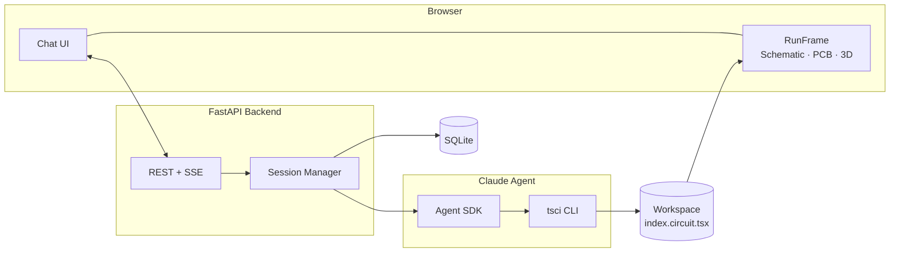
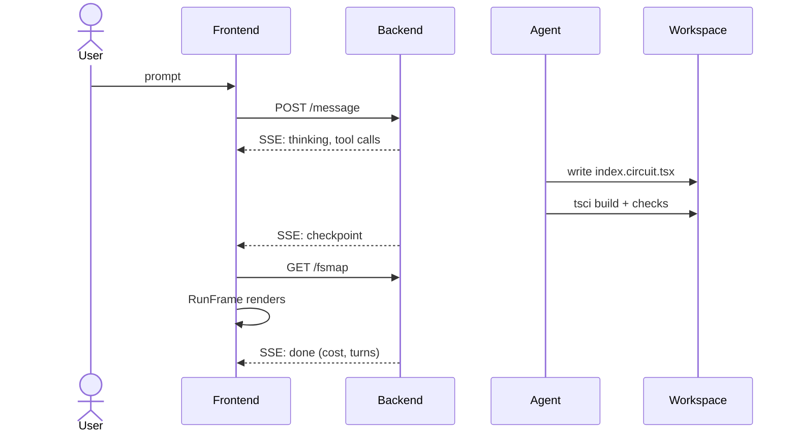
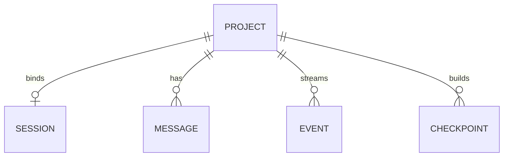

# VoltEdge: An Agentic Circuit-Design System

*Turning natural language into real, buildable PCBs through a Claude-powered agent, a code-as-circuit substrate, and live in-browser rendering.*

**Report date:** 2026-07-08
**System:** VoltEdge (self-hosted, single-user MVP)
**Repository state:** branch `manual-routing`, working tree clean

---

## Table of Contents

1. [Abstract](#1-abstract)
2. [Introduction](#2-introduction)
   - 2.1 [Motivation — Why It Is Needed](#21-motivation--why-it-is-needed)
   - 2.2 [Importance and Contributions](#22-importance-and-contributions)
   - 2.3 [Target Users](#23-target-users)
3. [Technology Stack](#3-technology-stack)
4. [Methodology](#4-methodology)
   - 4.1 [De-Risking Through Spikes](#41-de-risking-through-spikes-phase-0)
   - 4.2 [The Three-Layer Agent Harness](#42-the-three-layer-agent-harness)
   - 4.3 [Part-Sourcing Strategy](#43-part-sourcing-strategy)
   - 4.4 [Convergence Control](#44-convergence-control)
   - 4.5 [Fidelity: The Two-Compiler Problem](#45-fidelity-the-two-compiler-problem)
   - 4.6 [Sub-Second Workspace Provisioning](#46-sub-second-workspace-provisioning)
5. [System Architecture](#5-system-architecture)
   - 5.1 [High-Level Architecture](#51-high-level-architecture)
   - 5.2 [Anatomy of a Turn](#52-anatomy-of-a-turn)
   - 5.3 [Backend](#53-backend)
   - 5.4 [Frontend](#54-frontend)
   - 5.5 [The Agent Layer](#55-the-agent-layer)
   - 5.6 [Interactive Editing](#56-interactive-editing)
   - 5.7 [Data Model](#57-data-model)
   - 5.8 [Security and Guardrails](#58-security-and-guardrails)
6. [Results](#6-results)
7. [Discussion & Limitations](#7-discussion--limitations)
8. [Future Work](#8-future-work)
9. [Appendices](#9-appendices)

---

## 1. Abstract

VoltEdge is a self-hosted, single-user web application in which a Claude-powered
agent turns natural-language prompts — for example, *"Create a 555 LED blinker on a
2-layer 40×30 mm board"* — into real, buildable printed-circuit-board (PCB) designs.
Designs are authored as [tscircuit](https://tscircuit.com) code (React/TypeScript
circuit descriptions), validated deterministically with the `tsci` command-line
toolchain, and rendered live in the browser as interactive **Schematic / PCB / 3D**
views that support drag-to-edit and in-browser re-autorouting.

The system is composed of three cooperating pieces — a React 19 frontend, a FastAPI
backend, and a Claude agent driven through the Claude Agent SDK — bound together by a
Server-Sent Events (SSE) stream that exposes the agent's full reasoning (thinking,
tool calls, checkpoints) to the user in real time and persists it for later replay.

The project's central hypothesis is that **code-as-circuit is the correct substrate
for large-language-model-driven electronic design automation (EDA)**: the agent
manipulates text, a deterministic toolchain validates it, and the browser re-evaluates
the exact same source the agent produced — eliminating any gap between "what the agent
made" and "what the user sees." Empirically, the system produces validated boards at
approximately **US$0.10–0.19 per agent turn**, scaffolds a new isolated project
workspace in roughly **0.5 seconds** (via a hardlinked shared template), and has
demonstrated a complete end-to-end result: a routed NE555 astable LED blinker —
schematic, 2-layer PCB, 3D render, sourced parts, and silkscreen — produced from a
single chat prompt.

---

## 2. Introduction

### 2.1 Motivation — Why It Is Needed

Designing even a modest printed circuit board today demands a steep and specialized
skill set. A newcomer must learn a full EDA suite (KiCad, Altium, Eagle), understand
schematic capture, manage component footprints and libraries, source real parts with
valid manufacturer numbers, and manually place and route copper — all before a single
board can be fabricated. This learning curve locks out a large population of capable
people: makers, students, and firmware developers who know precisely **what** they
want to build but not the intricate EDA **how**.

At the same time, large language models have become fluent at writing typed,
structured code against documented APIs. This creates an opportunity: if a circuit can
be expressed *as code*, then designing a board becomes a code-generation task — a
domain where modern models excel — rather than a GUI-manipulation task, where they do
not.

VoltEdge exists to close this gap. It replaces the EDA learning curve with a
conversation. A user describes intent in plain language; a Claude agent designs the
board — sourcing parts, wiring nets, placing components, running validation — while
**streaming its reasoning** so the user remains informed and in control. The output is
not a static picture but real, version-controllable tscircuit source code that
compiles to a canonical `circuit.json` and exports to a complete fabrication package
(Gerbers, bill of materials, pick-and-place files).

### 2.2 Importance and Contributions

VoltEdge is significant both as a **product** and as a **research artifact**. Its main
contributions are:

1. **A validated code-as-circuit substrate for agentic EDA.** By choosing tscircuit
   (React/TSX) as the representation, the agent operates in its strongest modality —
   writing typed TypeScript against a documented component library — instead of
   manipulating opaque binary EDA formats.

2. **A transparent, inspectable agent loop.** Every step of the agent's reasoning —
   thinking, tool calls, validation results, checkpoints — is streamed to the user and
   persisted as a replayable event log. The design surface *is* the reasoning trace.

3. **A high-fidelity render pipeline** that renders the exact source the agent wrote,
   evaluated in the browser, so the interactive preview cannot silently diverge from
   the design under construction.

4. **A practical agent-harness design** — a layered instruction stack, a
   command-allowlist permission model, an iteration budget, and native cost/turn caps
   — that keeps an autonomous loop on a real toolchain safe, bounded, and convergent.

5. **A systems optimization** — hardlink-based workspace provisioning — that reduces
   per-project isolation cost from tens of seconds to sub-second, with negligible
   marginal disk usage.

### 2.3 Target Users

| Persona | Need VoltEdge serves |
|---|---|
| **Maker / hobbyist** | Describe an idea and receive a real, buildable board without learning EDA. |
| **Firmware / embedded developer** | Prototype a breakout quickly, iterate by chatting, and export fabrication files. |
| **Hardware reviewer** | Read the agent's plan and validation output to decide whether to trust or adjust the design. |

The v1 scope is a **single-user, self-hosted MVP** relying on local Claude credentials.
Explicit non-goals for v1 include multi-user accounts and authentication, full design
version history with revert, guaranteed manufacturability (design-rule checking remains
the user's responsibility), automated board ordering, and offline operation.

---

## 3. Technology Stack

| Layer | Technology | Role |
|---|---|---|
| **Frontend framework** | React 19.2 + TypeScript 5.9 | Chat UI, session management, preview host |
| **Build tool** | Vite 8 | Dev server (`:5173`), proxies `/api` → backend |
| **Styling** | Tailwind CSS v4 (`@tailwindcss/vite`), Radix UI, `lucide-react` | Dark-themed component styling |
| **Circuit rendering** | `@tscircuit/runframe` 0.0.2160 + `@tscircuit/eval` | In-browser evaluation and Schematic/PCB/3D viewers |
| **Backend framework** | FastAPI + Uvicorn (`:8787`) | REST + SSE API, session orchestration |
| **Streaming** | `sse-starlette` (server), native `EventSource` (client) | Real-time agent event stream |
| **Persistence** | SQLModel + SQLite (`aiosqlite`) | Projects, messages, events, checkpoints |
| **Agent runtime** | `claude-agent-sdk` ≥ 0.2.110 | Long-lived `ClaudeSDKClient` per project |
| **Model** | `claude-sonnet-4-5` (`max_turns = 30`) | The design agent |
| **Circuit toolchain** | tscircuit `tsci` CLI 0.0.2001 | Init, search, import, check, build, export |
| **Runtime dependency** | Bun 1.3.14 | Hard requirement of `tsci` (shebang dependency) |
| **Language runtimes** | Node.js 22, Python ≥ 3.10 | Frontend / backend |

**Notably absent by design:** there is **no MCP server**, **no PostgreSQL or Redis**
(SQLite is sufficient for a single user), and **no authentication layer** (v1 relies on
local Claude Code credentials). A datasheet/parts MCP wrapping SnapEDA / Octopart /
DigiKey is a considered future addition but is deliberately not wired up.

---

## 4. Methodology

VoltEdge was built as much through **experimentation** as through engineering. The
system design is itself the result of a sequence of de-risking experiments, and several
of its most important properties are direct consequences of empirical findings.

### 4.1 De-Risking Through Spikes (Phase 0)

Before writing product code, five spikes were run (2026-07-05), all of which passed and
unblocked development:

| Spike | Question | Key finding |
|---|---|---|
| **P0-1** | Is the toolchain viable? | `tsci` works but **hard-requires Bun** (shebang); scaffolds pin `"latest"` and must be rewritten to a locked version; builds land at `dist/<entry>/circuit.json`. |
| **P0-2** | Non-interactive part import? | `tsci import C14877 --jlcpcb < /dev/null` imports exact LCSC parts with no interactive picker. |
| **P0-3** | Headless fabrication? | `tsci export -f gerbers` yields a complete fab zip (all Gerber layers, drill files, BOM CSV, pick-and-place CSV) non-interactively — the project's single biggest de-risk. |
| **P0-4** | Browser rendering? | Bundling RunFrame's runner from source is impractical (a long tail of undeclared dependencies); **React 19 is forced** by viewer peer-pins. |
| **P0-5** | Does the Agent SDK work end-to-end? | A real turn wrote, built, and streamed a circuit in **6 turns for ~US$0.18**. Critical: listing `Bash` in `allowed_tools` **bypasses** the permission-callback gate. |

The P0-5 permission finding directly shaped the production security model (see §5.8),
and P0-1's Bun/version/output-path findings are all encoded in the backend today.

### 4.2 The Three-Layer Agent Harness

The agent is steered by a **three-layer instruction stack**, ordered from most general
to most binding:

1. **The `tscircuit` skill** — roughly 95 per-element reference pages plus workflow
   documents describing the canonical design procedure: clarify requirements → source
   parts → define `pinLabels`/`pinAttributes` from datasheets *before* wiring → write
   TSX → validate in a fixed ladder → export.

2. **The `components` skill** — the local parts catalog and its inviolable
   *never-hand-model-a-catalog-part* rule.

3. **The system-prompt append** (in the backend `agent.py`) — the operative
   tie-breaker, encoding *observed failure corrections*. For example, it **reverses**
   the skill's schematic-sectioning advice ("prefer direct connections") after
   over-engineering was observed, prescribes recovery steps for autorouter failures,
   and pins the single-entry-file rule (`index.circuit.tsx` only).

This layering is itself a finding: static skill documentation proved insufficient, and
a feedback channel for correcting *observed* agent behavior (the append) became
necessary — and it must win any conflict with the general skills.

### 4.3 Part-Sourcing Strategy

The governing principle is **exhaust every existing source before modeling anything by
hand**. Hand-modeling is the last resort, not a convenient shortcut — it is where
datasheet hallucination risk concentrates. Sourcing follows a strict ordered fallback,
encoded consistently across the system prompt and both skills; the agent stops at the
first source that has the part:

1. **Local parts library** (`./parts/`) — five verified, dimensionally-correct dev
   boards (ESP32-C3 SuperMini, GY-521/MPU-6050, STM32 Blue Pill, Arduino Nano, Arduino
   Uno shield). If a part is in the catalog, it is *never* hand-modeled.
2. **tscircuit registry** — `tsci search --tscircuit` then `tsci add author/pkg` for a
   reusable community package.
3. **`@tscircuit/common`** — the official first-party package of standard **form-factor
   boards / carriers** (`ArduinoShield`, `RaspberryPiHatBoard`, `XiaoBoard`,
   `ProMicroBoard`, `MicroModBoard`, `ViaGridBoard`). Used for a standard board
   shape/carrier instead of hand-modeling an outline and headers. It is now
   **pre-installed in every workspace** (via the shared template), so the agent can
   reach for it without a mid-turn `npm install`.
4. **JLCPCB / LCSC** — `tsci search --jlcpcb` then `tsci import <part#>` for an
   authoritative supplier footprint and supplier part numbers.
5. **Hand-model from datasheet** — the last resort, reached only when sources 1–4 all
   miss; heavily guarded ("a single-inline-header breakout is NOT a DIP").

USB-C is a special case that bypasses the search entirely: the builtin
`<connector standard="usb_c" />` is always used rather than any JLCPCB import.

> **Design note.** An earlier revision of the flow treated `@tscircuit/common` only as
> a form-factor *template* mentioned in passing (and not installed), and let the agent
> jump to hand-modeling as an easy second option after the local library. The flow was
> restructured so that all existing sources — including `@tscircuit/common` — are
> exhausted first, and `@tscircuit/common` was pre-installed into the workspace template
> to remove the friction of sourcing it on demand. *How* a genuinely novel part is
> modeled once all sources miss is deliberately out of scope here and treated as a
> separate topic.

### 4.4 Convergence Control

A classic failure mode of agentic loops is thrashing against an infeasible constraint.
VoltEdge answers this with an **iteration budget**: at most **3 fix-and-rerun rounds
per failing check**, where a non-improving round earns no fresh budget. When the budget
is spent, the agent must **stop and escalate** to the user with concrete validation
output and ranked constraint relaxations (add a layer, enlarge the board, lower
density, split into groups, allow jumpers). This is made practical because
`tsci check routing-difficulty` can detect infeasibility *before* expensive routing is
attempted.

### 4.5 Fidelity: The Two-Compiler Problem

The original architecture rendered backend-built `circuit.json` in the browser
specifically to avoid two evaluators disagreeing ("two-compiler drift"). The shipped
system inverted this decision: the browser now evaluates the *same source files* the
agent wrote (via the RunFrame runner and a fetched file map), which buys interactivity —
drag, local re-autoroute — at the cost of reintroducing dual evaluation. This is
mitigated by **pinning the tscircuit version** in every workspace and by keeping the
backend `tsci build` as the *validation* authority: checkpoints fire only on a
successful backend build. The single-entry-file convention makes the contract
unambiguous — one file is what the agent writes, what the builder builds, and what the
viewer renders.

### 4.6 Sub-Second Workspace Provisioning

Each project receives an isolated tscircuit workspace. A naive full `tsci init` plus
dependency install (~221 packages) costs 30–50 seconds each. The shipped design builds
**one shared template** once, then **hardlinks** its `node_modules` tree into every new
workspace (regular files via `os.link`, symlinks recreated as symlinks), copying only
four small configuration files. The result is **~0.5 seconds per workspace with
near-zero marginal disk usage**.

A subtle interaction with the Agent SDK also shaped provisioning: the entry file
`index.circuit.tsx` is deliberately **not** pre-created, because the SDK's
read-before-write guard would otherwise block the agent's first `Write` on a file it
had never read.

---

## 5. System Architecture

### 5.1 High-Level Architecture

Three pieces share one contract: the workspace's `index.circuit.tsx` is simultaneously
the agent's output artifact, the build system's entry point, and the browser's render
input.

### 5.2 Anatomy of a Turn

1. The prompt is accepted (`202`, or `409` if a turn is already running) and a
   background task drives the agent turn under a per-project lock.
2. Every SDK message is mapped to a typed SSE event — `thinking`, `assistant_text`,
   `tool_use`, `tool_result`, `checkpoint`, `done`, `error` — published to live
   subscribers **and** persisted as an event record. Reloading the page replays the
   identical transcript.
3. **Checkpoints are detected, not declared:** the backend watches the modification
   time of the build artifact (`dist/*/circuit.json`). A newer artifact bumps a version
   counter, records a checkpoint, and emits a `checkpoint` event — the frontend's cue
   to refetch the file map and re-render.
4. The `done` event carries the turn count and dollar cost, rendered as a footer under
   the response.

### 5.3 Backend

The FastAPI backend (~1,100 lines across 11 modules, port `:8787`) owns projects,
workspaces, the SSE relay, event persistence, and one long-lived `ClaudeSDKClient` per
project. Key modules:

- **`config.py`** — Pydantic settings (model, `max_turns=30`, `scaffold_timeout_s=180`,
  pinned `tscircuit_version=0.0.2001`, paths, CORS origins).
- **`sessions.py`** — the `SessionManager` and turn driver: long-lived per-project
  client, per-project `asyncio.Lock` serializing turns, checkpoint detection, event
  persistence.
- **`workspace.py`** — scaffolding (template + hardlink), the file-map reader, and the
  placement rewrite used by drag-to-edit.
- **`agent.py`** — Agent SDK options, the VoltEdge system-prompt append, and the Bash
  command allowlist.
- **`events.py`** — an in-memory `EventBus` fanning out to SSE subscriber queues, with
  slow-consumer protection (bounded queues that silently drop when full).
- **`routes.py`** — the HTTP + SSE API surface (see [Appendix A](#appendix-a--api-surface)).

### 5.4 Frontend

A React 19 single-page app orchestrated by one central component that owns all state
via React hooks (no external state library is wired up despite some being declared).
The layout is a session sidebar beside a resizable split of chat panel and preview
pane.

- **Transcript rendering** — a dispatcher switches on each event type to render user
  bubbles, collapsible *thinking* accordions, colored tool-call chips, checkpoint
  banners, and a per-turn cost/step footer. Because persisted history shares the exact
  `{type, data}` shape of live SSE events, one renderer serves both live streaming and
  full transcript restoration on reload.
- **Preview** — the `PreviewPane` hosts RunFrame, which evaluates the fetched file map
  **in the browser** using a bundled eval web-worker (chosen to avoid CORS-blocked CDN
  fetches). The 3D/CAD tab is gated on a runtime WebGL probe for graceful degradation.

### 5.5 The Agent Layer

The agent runs `claude-sonnet-4-5` through the Claude Agent SDK inside each project's
workspace. Its configuration:

- `permission_mode = "acceptEdits"` — auto-allows Write/Edit **within the workspace**.
- `system_prompt` — the Claude Code preset plus the VoltEdge steering append.
- `skills = ["tscircuit", "components"]`, mounted per-workspace at scaffold time.
- `allowed_tools = ["Read", "Write", "Edit", "Glob", "Grep"]` — **Bash is deliberately
  excluded** here (listing it would pre-approve and bypass the permission callback).
- `can_use_tool` — the sole Bash gate, enforcing a command-prefix allowlist and
  confining Write/Edit paths inside the workspace.

### 5.6 Interactive Editing

- **Drag-to-edit (shipped).** Dragging a part emits an edit event; the frontend
  resolves the dragged element to its source component name via the circuit JSON, calls
  `PUT /placement`, and the backend regex-rewrites the exact `pcbX/pcbY` (or
  `schX/schY`) props in source — using exact `repr()` floats, because the viewer's
  movement check requires bit-exact center equality. The next **Run** re-evaluates and
  re-autoroutes from the moved pins, in the browser.
- **Manual trace routing (in design).** Despite being this branch's namesake, manual
  routing is currently a validated spike plus a written plan, not shipped code. The
  spike confirmed `<trace pcbPath={[...]}>` produces real copper with layer-crossing
  vias, that path coordinates are relative to the *from*-component center, and —
  importantly — that pinning some traces manually can **break autorouting of the
  remaining nets** (2 pinned traces produced 4 trace errors where full autorouting had
  0). This negative result is arguably the most valuable finding on the branch.

### 5.7 Data Model

Five SQLite tables: `project` (id, title, working directory), `sessionrecord` (Claude
session id for resume), `messagerecord` (plain chat transcript), `eventrecord` (the
full typed event stream — the replayable "flight recorder"), and `checkpointrecord`
(monotonic build versions). The event stream *is* the UX.

### 5.8 Security and Guardrails

| Layer | Guardrail |
|---|---|
| **Permissions** | Write/Edit confined to the workspace; Bash gated by a prefix-allowlist (`tsci`, `npm`, `bun`, `git`, and read-only utilities), deliberately excluded from `allowed_tools`. |
| **Cost** | `max_turns = 30`; observed ~US$0.10–0.19/turn; per-turn cost displayed in the UI. |
| **Concurrency** | A `409` on a busy project plus a per-project lock prevent concurrent turns. |
| **Design integrity** | "Never silently change a user-specified constraint" (board size, layer count, chosen parts). |
| **Iteration** | Hard budget of 3 fix-and-rerun rounds per failing check, then escalate. |
| **Manufacturability** | Explicitly user-owned; DRC review required before ordering. |

---

## 6. Results

- **Feasibility — confirmed.** The flagship run — a single prompt producing a complete
  NE555 astable blinker (68 kΩ/68 kΩ/10 µF ≈ 1 Hz timing network, 330 Ω LED limiter,
  WJ500V screw terminal, 2-layer 40×30 mm board, silkscreen, placement constraints
  honored, validation run, checkpointed) — demonstrates the full pipeline.
- **Cost / latency.** ~US$0.10–0.19 per turn for simple boards; 6 SDK turns for a
  trivial board; workspace scaffold ~0.5 s (versus 30–50 s naive); first *thinking*
  token targeted under 2 s.
- **Fidelity.** The checkpoint-on-artifact-mtime mechanism plus a pinned toolchain has
  held; render-versus-build drift has not been a reported failure mode.
- **Interactivity.** Placement round-trips losslessly; routing does not yet.

---

## 7. Discussion & Limitations

- **Validation is delegated, not owned.** The backend performs no independent
  electrical verification; correctness rests on `tsci`'s checks and the agent following
  its ladder. There is no guarantee the agent *ran* the checks — a checkpoint fires on
  any fresh build artifact.
- **The evaluation is anecdotal.** Evidence consists of spike measurements and one
  flagship run. There is no benchmark suite of prompts with pass/fail criteria and no
  measurement of design-quality regressions across model or toolchain versions. Test
  coverage mirrors this: scaffolding, placement rewrite, CRUD, and event history are
  unit-tested; the agent loop, SSE streaming, and build pipeline are not.
- **The single-evaluator assumption is fragile.** In-browser evaluation reintroduces
  the drift risk the original architecture eliminated; version pinning mitigates but
  does not remove it (the template's `package.json` already carries `^0.0.2006` while
  the backend pins `0.0.2001`).
- **Human-in-the-loop is thinner than specced.** The soft plan gate, hard-block
  questions, and budget-cap `paused` states exist in the event taxonomy and the spec
  but are not yet rendered or wired — today's control surface is essentially the stop
  button.
- **Security hardening gaps.** Assistant markdown is rendered via
  `dangerouslySetInnerHTML` without visible sanitization.
- **Ecosystem dependence.** The system rides tscircuit's fast-moving 0.0.x releases,
  its registry/CDN availability, and a half-built upstream viewer feature (trace
  editing) — a real external-validity constraint.

---

## 8. Future Work

Ordered by leverage:

1. **Manual trace routing** with live DRC feedback (plan written, spike validated).
2. **First-class validation/DRC results** in the UI, not truncated error strings.
3. **Fabrication-export UI** with the manufacturability caveat (headless export already
   proven).
4. **Plan cards and hard-block question flow** (events already defined in the taxonomy).
5. **Session idle-teardown and resume** (the SDK `resume` id is already stored).
6. **A prompt→board benchmark suite** to turn the anecdotal evaluation into a
   regression-tested one.
7. **An optional datasheet/parts MCP** (SnapEDA / Octopart / DigiKey) as a fifth
   sourcing tier.

---

## 9. Appendices

### Appendix A — API Surface

| Method | Path | Purpose |
|---|---|---|
| POST | `/api/projects` | Create project + scaffold workspace |
| GET / PATCH / DELETE | `/api/projects[/{id}]` | List / rename / delete (evicts session, wipes workspace) |
| POST | `/api/projects/{id}/message` | Start an agent turn (`409` if busy) |
| POST | `/api/projects/{id}/interrupt` | Stop the running turn |
| GET | `/api/projects/{id}/events` | Live SSE stream (15 s ping keepalive) |
| GET | `/api/projects/{id}/events/history` | Persisted transcript for replay |
| GET | `/api/projects/{id}/fsmap` | Workspace source files for RunFrame |
| PUT | `/api/projects/{id}/placement` | Drag-to-edit source rewrite |
| GET | `/api/health` | Liveness |

### Appendix B — SSE Event Taxonomy

`connected` · `thinking` · `assistant_text` · `tool_use` · `tool_result` · `plan`\* ·
`question`\* · `checkpoint` · `build_status`\* · `paused`\* · `error` · `done`

*Types marked \* are defined in the contract but not yet emitted or rendered.*

### Appendix C — Key Versions & Constants

Node 22 · Bun 1.3.14 (hard requirement of `tsci`) · tscircuit CLI 0.0.2001 (pinned) ·
`@tscircuit/runframe` 0.0.2160 · `claude-agent-sdk` ≥ 0.2.110 · model
`claude-sonnet-4-5` · `max_turns = 30` · scaffold timeout 180 s · backend `:8787` ·
frontend `:5173` · SQLite at `data/volt-edge.db`.
